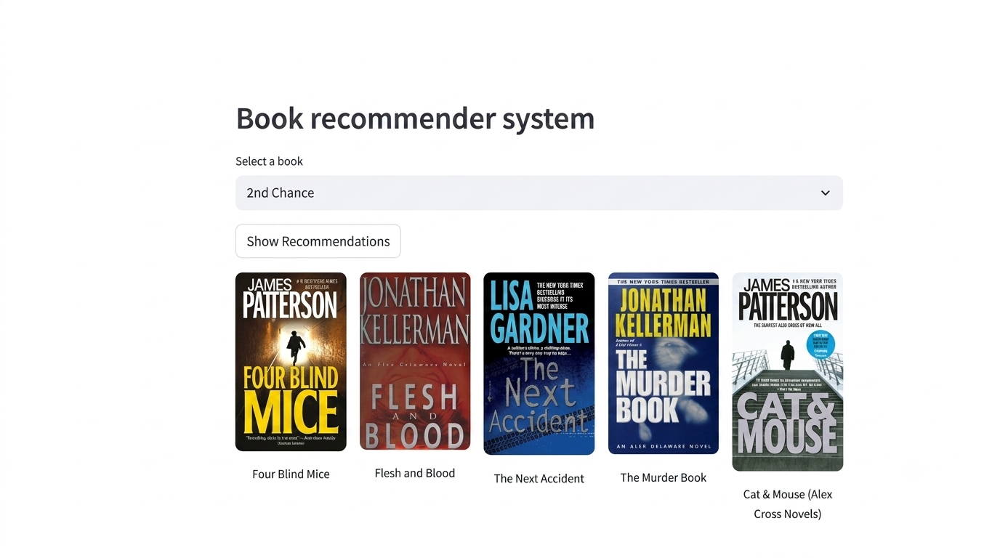

# AI-Powered Book Recommendation System

An intelligent book recommendation system that suggests similar books based on a user's selected title, built with Python and deployed as an interactive Streamlit web app.



## Features

- Suggests similar books based on a selected title
- Uses K-Nearest Neighbors (KNN) with cosine similarity for matching
- Applies Truncated SVD to handle sparse data and improve recommendation accuracy
- Clean, interactive Streamlit interface with visual output

## Tech Stack

- **Python**
- **Scikit-learn** — KNN, Truncated SVD
- **Pandas / NumPy** — data processing
- **Streamlit** — web app interface

## Project Structure

```
├── app.py                          # Streamlit web app
├── book_recommender.ipynb          # Model training & experimentation notebook
├── artifacts/                      # Saved trained models (pickle files)
└── data/                           # Training dataset (not included — see Dataset section)
```

## Dataset

This project was trained on a publicly available book ratings dataset (Book-Crossing style data: books, users, and ratings). The dataset itself is not included in this repository due to file size.

To run the app (app.py), no dataset is needed — the pre-trained model artifacts in the artifacts/ folder are sufficient.

The dataset is only required if you want to retrain the model using book_recommender.ipynb. In that case, place the equivalent CSV files in a data/ folder before running the notebook.

## How to run


Clone this repository


   git clone https://github.com/fakhur29/book-recommendation-system.git


Navigate into the project folder


   cd book-recommendation-system


Install the required dependencies


   pip install -r requirements.txt


Run the Streamlit app


   streamlit run app.py


The app will open in your browser — select a book title to get recommendations

## How It Works

1. The notebook (`book_recommender.ipynb`) processes the dataset and trains a KNN model using cosine similarity, refined with Truncated SVD
2. The trained model is saved as pickle files in `artifacts/`
3. `app.py` loads these artifacts and serves recommendations through a Streamlit interface

## Author

**Fakhur Ali**
Final-year BSIT student | AI/ML Developer
[LinkedIn](https://linkedin.com/in/fakhur-ali-11a29326b)
